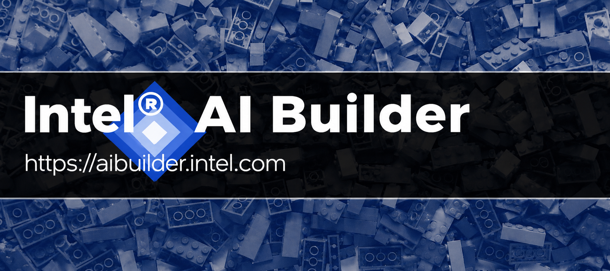

<h1 align="center">Intel® AI Builder</h1>

<strong>Intel® AI Builder</strong> is Intel’s Gen-AI reference design platform that enables the rapid creation of custom AI assistants and agents tailored to specific industry needs and proprietary data. 

There are 2 main offerings within the Intel AI Builder platform: 

1. [Intel AI® SuperClaw](./superclaw/README.md)
2. [Intel AI® SuperBuilder](./superbuilder/README.md)

### 🦀 Introducing SuperClaw — Local-First Hybrid Agentic AI

**SuperClaw** is a new hybrid agentic AI solution that runs powerful AI agents directly on your Intel AI PC while seamlessly routing to cloud models only when the task demands it. Think of it as your personal AI workforce — coding, researching, managing emails, and automating workflows — all while keeping sensitive data private and slashing cloud token costs by over 50%.

**What makes it special:**
- 🖥️ **Edge-first architecture** — routine work stays on-device; cloud kicks in only for advanced reasoning
- 🤖 **Purpose-built agents** — Coding, Deep Research, Email & Calendar, File Analysis, and Web Search
- 🔒 **Privacy by design** — PII-aware routing keeps confidential data inside your perimeter
- ⚡ **Two-plane deployment** — a Windows client app + a Linux Inference Edge Server you fully control

 

With Intel® AI Builder, you can empower your teams and customers with intelligent, adaptable, and secure AI solutions—delivered simply and on your terms.

## Get Support
For technical questions and feature requests, please use GitHub [Issues](https://github.com/intel/intel-ai-builder/issues).

We would love to hear about your experience. Please contact us at [&#115;&#117;&#112;&#112;&#111;&#114;&#116;&#046;&#097;&#105;&#098;&#117;&#105;&#108;&#100;&#101;&#114;&#064;&#105;&#110;&#116;&#101;&#108;&#046;&#099;&#111;&#109;](mailto:support.aibuilder@intel.com).

[Back to Top](#toc)